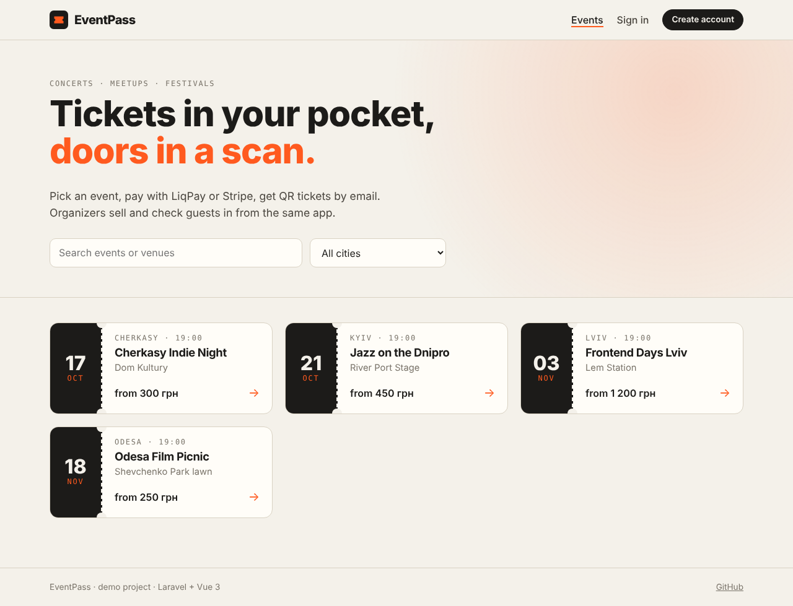
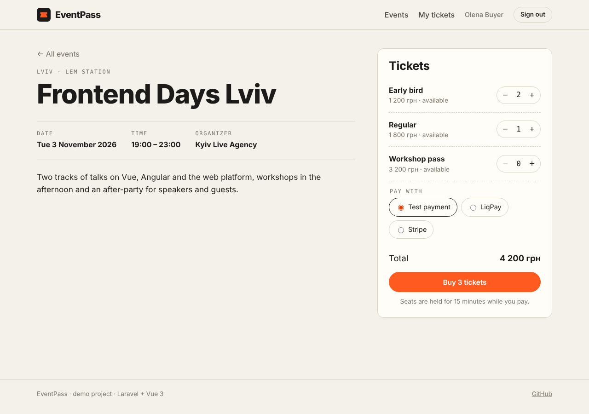
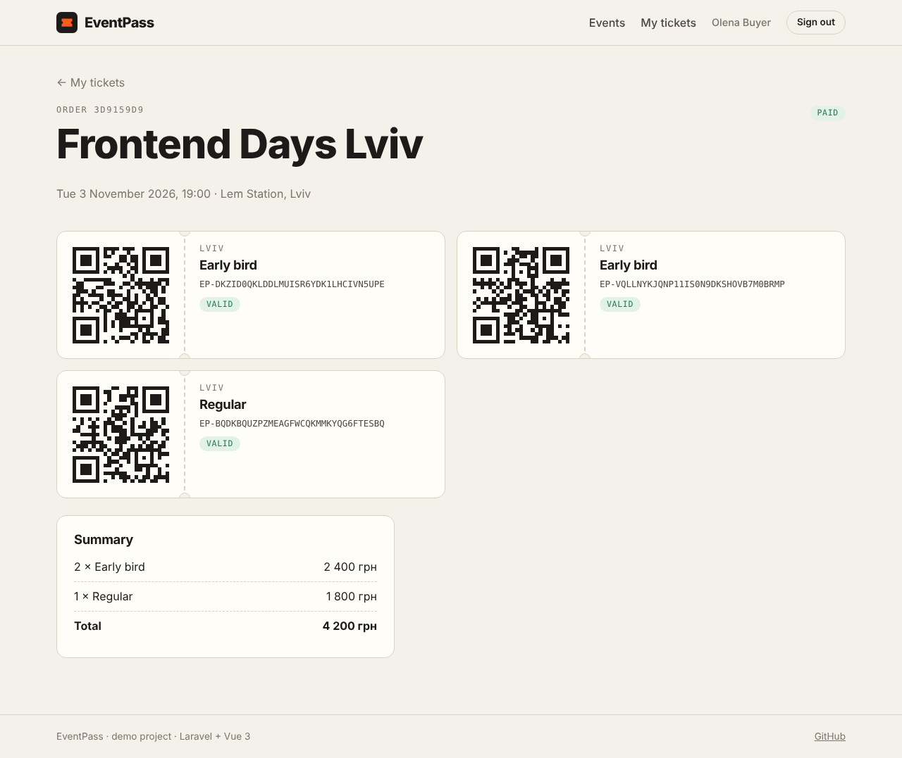
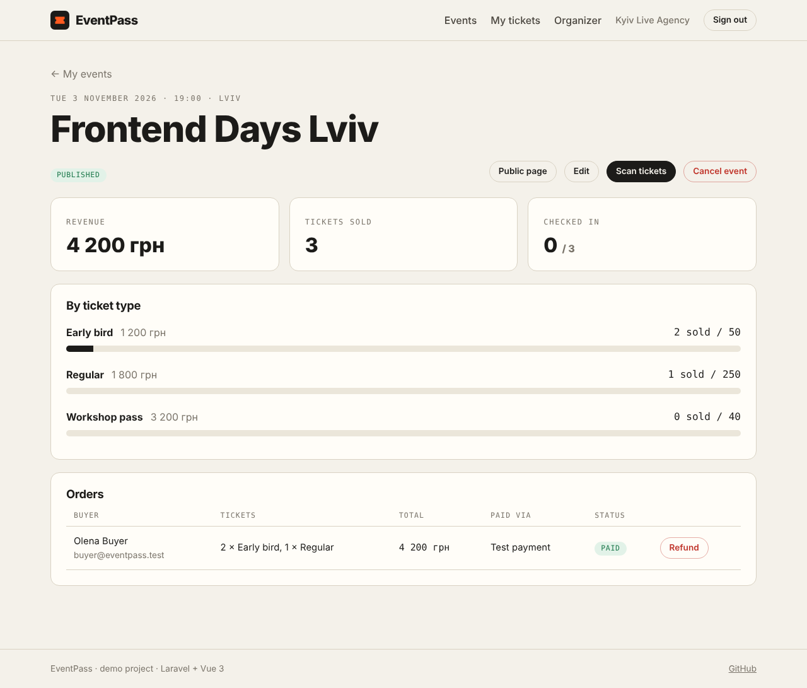
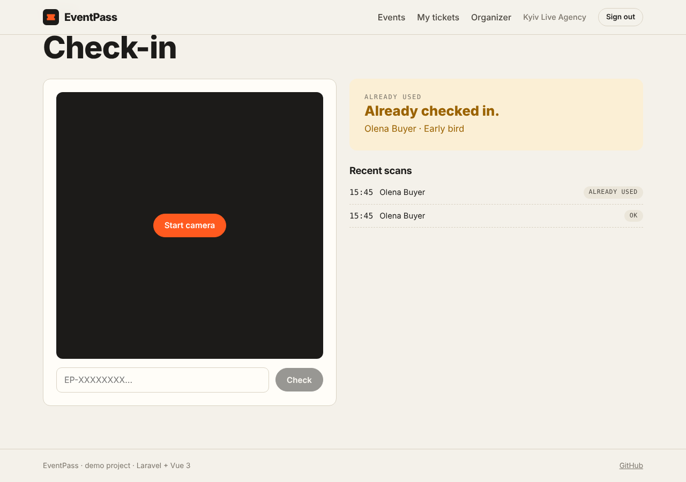
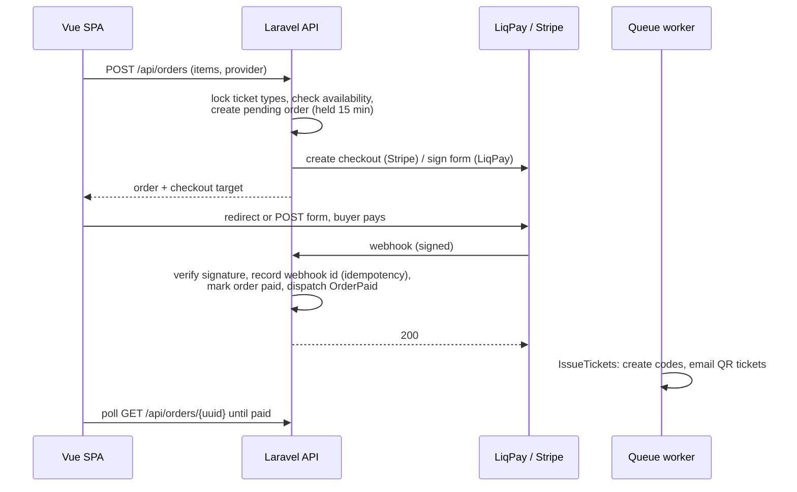

# EventPass

Event ticketing app: organizers publish events and sell tickets, buyers pay online through **LiqPay** or **Stripe** and get QR-code tickets by email, staff scan the tickets at the door.

**Stack:** Laravel 13 (PHP 8.3) · Vue 3 + TypeScript · Vue Router · Pinia · PostgreSQL · Redis queues · Docker



| Buying tickets | Tickets with QR codes |
| --- | --- |
|  |  |
| **Organizer dashboard** | **Door check-in** |
|  |  |

## What it covers

**Backend (Laravel)**

- REST API with Form Requests, API Resources, Policies and a role middleware (customer / organizer / admin)
- Cookie-based SPA auth with **Sanctum**: register, login with rate limiting, email verification, password reset
- **Google sign-in** with Socialite
- **Payments behind one interface** (`PaymentGateway`) with three drivers: LiqPay, Stripe and a local test gateway. Both real providers are called through the plain HTTP client (no SDK), so request signing and webhook verification are explicit in the code
- **Webhooks:** signature checks (LiqPay `sha1` signature, Stripe `HMAC-SHA256` with a replay window), idempotent handling, late and mismatched payments refunded automatically
- **Seat reservation without overselling:** row locks (`SELECT … FOR UPDATE`) inside a transaction, 15-minute holds released by the scheduler
- **Queues:** ticket issuing and emails run in a queued listener with retries; QR codes are rendered into the email
- Scheduler (`orders:expire` every minute), Eloquent relations, factories, seeders
- **45 Pest tests** (auth, permissions, ordering, webhooks, refunds, check-in, email)

**Frontend (Vue 3)**

- Composition API + TypeScript (`<script setup>`), strict type-check with `vue-tsc`
- Vue Router with lazy routes and guards (auth, guest-only, organizer role)
- Pinia stores: `auth` (session restore), `cart` (ticket selection that survives the login detour), `toast`
- Axios client with Sanctum CSRF cookie flow and automatic retry on an expired token (419)
- Checkout handoff for both provider styles: redirect (Stripe) and auto-submitted POST form (LiqPay)
- Order page that polls while the webhook is in flight, with a countdown for the seat hold
- Organizer area: event editor with ticket types, sales stats, refunds, and a **camera QR scanner** (jsQR) with manual fallback
- Responsive layout, Vitest unit tests

## How a purchase works



Design notes worth pointing out:

- **Money is stored in minor units** (kopecks/cents) as integers.
- **Availability is derived, not counted:** seats taken = items of pending + paid orders. Expired or cancelled orders free their seats automatically, with no counters to drift.
- **Every webhook is stored once** under a unique `(provider, event_id)` key, so a provider's retry cannot pay an order twice or issue a second set of tickets.
- **Late payment:** if money arrives after the hold expired, the order is accepted only if seats are still free; otherwise the payment is refunded through the gateway. A paid amount that differs from the order total is refunded too.
- **Double scan at the door** is resolved by a conditional `UPDATE … WHERE checked_in_at IS NULL`, so two devices scanning the same ticket at once let only one through.
- **SPA and API share one origin** in development (Vite proxies `/api`, `/sanctum`, `/auth/google`), so Sanctum session cookies work without CORS setup.

## Run it

### With Docker (recommended)

Requires Docker Desktop.

```bash
git clone https://github.com/MOlexiy/EventPass.git
cd EventPass
docker compose up --build
```

| What | URL |
| --- | --- |
| App (Vue SPA) | http://localhost:5173 |
| API | http://localhost:8000 |
| Mailpit (sent emails: verification, tickets) | http://localhost:8025 |

The first start migrates and seeds the database. Containers: `api`, `queue` (worker), `scheduler`, `frontend`, `postgres`, `redis`, `mailpit`.

### Without Docker

Requires PHP 8.3+ (extensions: gd, pdo_sqlite, intl), Composer and Node.js 24.

```bash
# API on SQLite, emails go to storage/logs/laravel.log
cd backend
composer install
cp .env.example .env
php artisan key:generate
touch database/database.sqlite
php artisan migrate --seed
php artisan serve                 # terminal 1
php artisan queue:work            # terminal 2
php artisan schedule:work         # terminal 3 (expires unpaid orders)

# SPA
cd frontend
npm install
npm run dev                       # http://localhost:5173
```

### Demo accounts

All passwords are `password`. The sign-in page has buttons that fill them in.

| Role | Email |
| --- | --- |
| Buyer | buyer@eventpass.test |
| Organizer | organizer@eventpass.test |
| Admin | admin@eventpass.test |

## Payments

Out of the box only the **test gateway** is enabled: it shows a mock bank page and sends a signed callback through the same webhook pipeline as the real providers, so the whole flow works without any keys.

To enable real sandboxes, set `PAYMENT_GATEWAYS=fake,liqpay,stripe` (root `.env` for Docker, `backend/.env` otherwise) and add keys:

**LiqPay (sandbox)**

1. Get sandbox keys in the LiqPay merchant cabinet and set `LIQPAY_PUBLIC_KEY`, `LIQPAY_PRIVATE_KEY`, `LIQPAY_SANDBOX=true`.
2. LiqPay must reach your webhook, so expose the API: `ngrok http 8000`, then set `WEBHOOK_BASE_URL=https://<your-id>.ngrok-free.app`.

**Stripe (test mode)**

1. Set `STRIPE_SECRET=sk_test_…`.
2. Forward webhooks with the Stripe CLI and copy the `whsec_…` it prints into `STRIPE_WEBHOOK_SECRET`:
   ```bash
   stripe listen --forward-to localhost:8000/api/webhooks/stripe \
     --events checkout.session.completed,checkout.session.expired,charge.refunded
   ```
3. Pay with the test card `4242 4242 4242 4242`.

Note: Stripe accounts must support the event currency (UAH by default).

## Google sign-in

Create an OAuth client (type "Web application") in Google Cloud Console with the redirect URI `http://localhost:5173/auth/google/callback`, then set `GOOGLE_CLIENT_ID` and `GOOGLE_CLIENT_SECRET`.

## Tests

```bash
cd backend && vendor/bin/pest          # 45 feature/unit tests, SQLite in memory
cd frontend && npx vitest run          # store and utility tests
cd frontend && npm run type-check      # vue-tsc
```

GitHub Actions runs Pint, Pest, the type-check, Vitest and the production build on every push.

## API overview

| Method | Endpoint | Who |
| --- | --- | --- |
| POST | `/api/auth/register`, `/api/auth/login`, `/api/auth/logout` | guest / user |
| GET | `/api/auth/user` | user |
| POST | `/api/auth/forgot-password`, `/api/auth/reset-password` | guest |
| GET | `/api/auth/email/verify/{id}/{hash}` (signed link) | anyone |
| GET | `/auth/google/redirect`, `/auth/google/callback` | guest |
| GET | `/api/events?q=&city=`, `/api/events/{slug}`, `/api/events/cities` | public |
| GET | `/api/payments/providers` | public |
| POST | `/api/orders` (reserve + start payment) | verified user |
| GET | `/api/orders`, `/api/orders/{uuid}` | owner |
| POST | `/api/orders/{uuid}/checkout` (retry), `/api/orders/{uuid}/cancel` | owner |
| POST | `/api/webhooks/{liqpay\|stripe\|fake}` | payment provider (signed) |
| GET/POST/PUT/DELETE | `/api/organizer/events[/{slug}]` | organizer |
| POST | `/api/organizer/events/{slug}/publish`, `/cancel` | organizer |
| GET | `/api/organizer/events/{slug}/stats`, `/orders` | organizer |
| POST | `/api/organizer/events/{slug}/check-in` | organizer |
| POST | `/api/organizer/orders/{uuid}/refund` | organizer |

## Project layout

```
backend/                      Laravel 13 API
  app/Payments/               PaymentGateway interface, LiqPay / Stripe / Fake drivers
  app/Services/               OrderService (reservations), PaymentService (webhooks, refunds)
  app/Http/Controllers/       Auth, Events, Orders, Payments, Check-in, Organizer
  app/Listeners/IssueTickets  queued: create tickets, send email
  app/Policies/               Event and Order authorization
  routes/api.php              API routes; routes/console.php has the scheduler
  tests/                      Pest tests
frontend/                     Vue 3 SPA
  src/api/                    axios client, typed endpoints
  src/stores/                 Pinia: auth, cart, toast
  src/router/                 routes and guards
  src/views/                  pages (buyer, auth, organizer)
docker-compose.yml            full local stack
```

## Possible next steps

- Two-factor authentication (TOTP) for organizer accounts
- PDF tickets attached to the email
- Event cover uploads to S3-compatible storage
- Bulk refund when an organizer cancels an event
